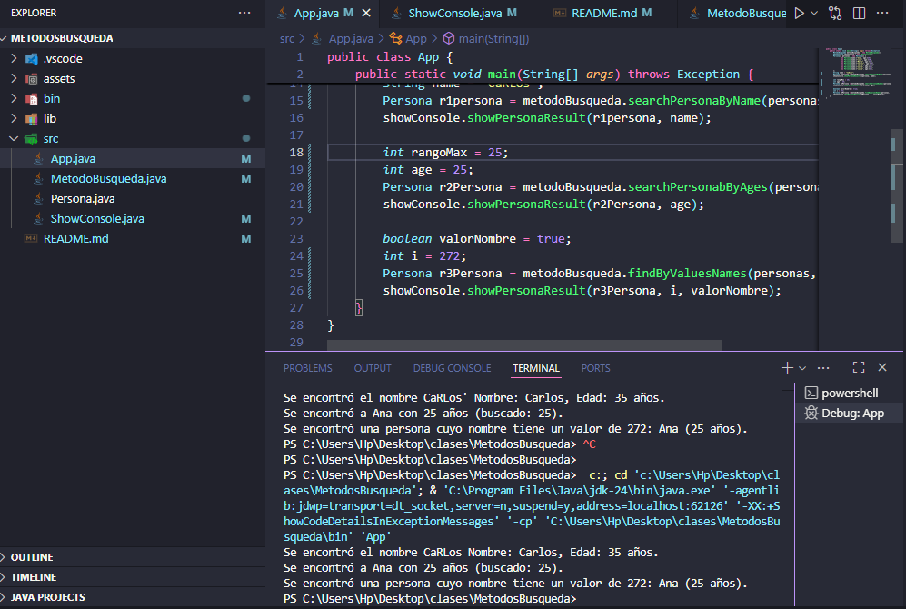

# Proyecto de Búsqueda de Personas



Programa en Java que realiza búsquedas personalizadas en un arreglo de objetos `Persona`.

## Descripción

El programa aplica **búsqueda secuencial**, **condiciones personalizadas** y **sobrecarga de métodos**, trabajando con un arreglo de personas.

### Tipos de búsqueda implementadas

1. **Por nombre**  
   Busca una persona según su nombre (insensible a mayúsculas).

2. **Por edad impar y mayor a un valor dado**  
   Devuelve la primera persona que cumpla ambas condiciones.

3. **Por valor numérico del nombre**  
   Calcula el valor ASCII total del nombre y compara con el valor buscado.

### Clases

- **App** → contiene el método principal y ejecuta las pruebas.  
- **MetodoBusqueda** → incluye los tres métodos de búsqueda.  
- **Persona** → define los atributos `name` y `age`.  
- **ShowConsole** → muestra resultados en consola con métodos sobrecargados.

### Ejecución

Compila y ejecuta con:
```
javac *.java
java App
```

O simplemente presiona **F5** en Visual Studio Code.

### Autor
**Joshue Avecillas**  
Estructura de Datos – 2025
